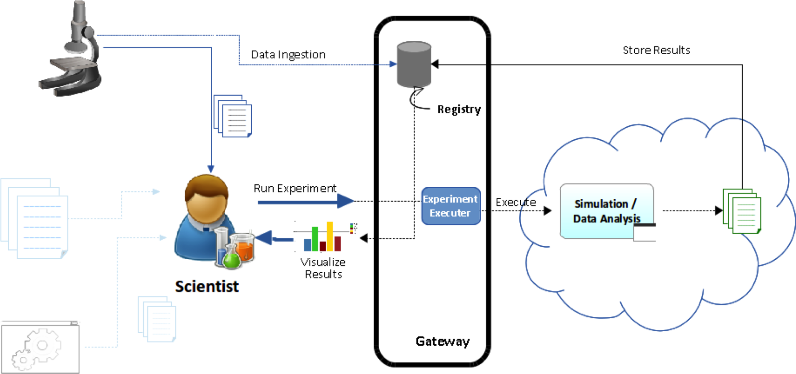
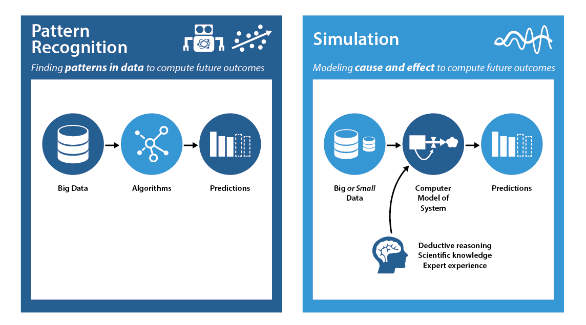
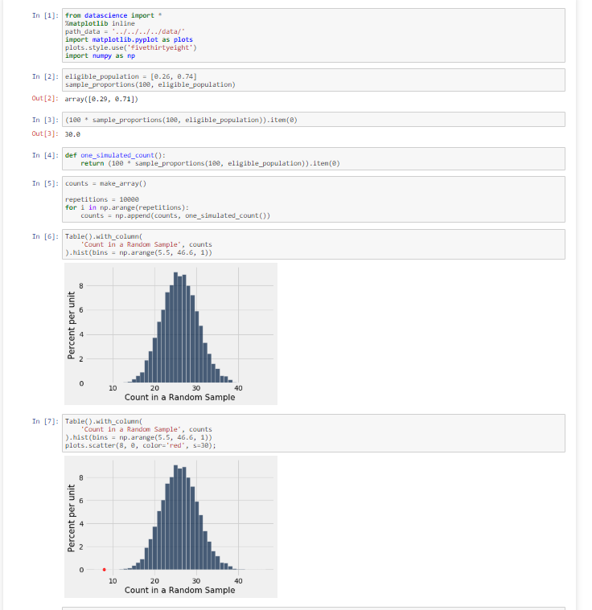

```{r global_options, echo=FALSE}
knitr::opts_chunk$set(warning=FALSE, message=FALSE)
```

## Introduction
### What are simulations and why is it used

```{r, out.width = "600px", echo=FALSE, fig.align='default'}


```
  

- Avoid reuse of code
- Experiment and testing a hypothesis
- Without Simulations Data Science would be:
  - Time consuming
  - Costly
  
## Simulations Vs Pattern Recongnition

```{r, out.width = "600", echo=FALSE, fig.align='default'}


```

- Pattern Recognition
  - Maps Future Trends by finding patterns in data
  - Minimum up-front knowledge
  - Uncover unknown casual relationships
  
- Simulations
  - Future trends by cause and affect
  - Uses existing data to build models that help estimate missing factors. 
  - Perform well event with minimal data, so less data and processing cost 
  
  
## Use cases
### Some known use cases

```{r, out.width = "600px", echo=FALSE, fig.align='default'}


```
  

- Market basket analysis
- Self Driving Cars
- Employees Shift analysis
- Evaluation of bias in Jury Selection
- Many others...

## Examples
### R

- Functions
  - Random
  - Sample
  - Set.seed
  - Normal distribution functions
      - Rnorm, dnorm, pnorm, rpois 
  - simmer

- In this example with use Discrete Event Simulation (DES) which is a model of a physical system that has changes at precise point in simulated time. In comparison a continuous Event Simulations would be based on systems with continuous 

- This DES example uses:
  - Medical Staff
    - Doctors
    - Nurses
    - Administrators
    
- Objective- Determine best number of staff to reduce patient queue

- Based on Youtube video:
  - https://www.youtube.com/watch?v=Qe1NvHJcmZs
  
## Examples
### R Code

```{r echo=TRUE}
# Create Model
rm(list=ls())

library(simmer)
library(magrittr)

simu<-function(x,y,z)
    {

env <-simmer("outpatient clinic")
env
patient<- trajectory("patients path")%>% 
    seize("nurse",1) %>% 
    timeout(function() rnorm(1,15)) %>% 
    release("nurse",1) %>%
    seize("doctor",1) %>% 
    timeout(function() rnorm(1,5)) %>% 
    release("doctor",1) %>%
    seize("administrator",1) %>% 
    timeout(function() rnorm(1,5)) %>% 
    release("administrator",1)


    env%>%
        add_resource("nurse",x)%>%
        add_resource("doctor",y)%>%
        add_resource("administrator",z)%>%
        add_generator("patient", patient ,function() rnorm(1, 5, 0.5))
    
    env%>%run(until=540)
    }
simu(2,3,2)
simu(3,3,3)
simu(4,3,2)
```

## Examples
### Python

- Functions
  - numpy
  - sample_proportions
  
- Trial
  - Jury selection
    - State say Jury selection was not biased
    - Defense was to prove selection did not randomly select jurors from population
    
- Based on Jynypter code in below link
    - https://hub.gke.mybinder.org/user/data-8-textbook-43fgoywx/notebooks/content/chapters/11/1/Assessing_Models.ipynb
    
## Examples
### Python Code

```{r, out.width = "800px", echo=FALSE, fig.align='default'}


```
  
## Conclusion


```{r, out.width = "200px", echo=FALSE, fig.align='default'}


```

- Without simulations Data Science would be:
  - Costly
  - Time consuming


## References

https://web.stanford.edu/class/bios221/labs/simulation/Lab_3_simulation.html

http://www.columbia.edu/~cjd11/charles_dimaggio/DIRE/resources/R/simRreg.pdf

https://www.youtube.com/watch?v=Qe1NvHJcmZs

https://hub.gke.mybinder.org/user/data-8-textbook-43fgoywx/notebooks/content/chapters/11/1/Assessing_Models.ipynb

https://www.dimins.com/blog/2018/01/26/simulation-in-predictive-analytics/


